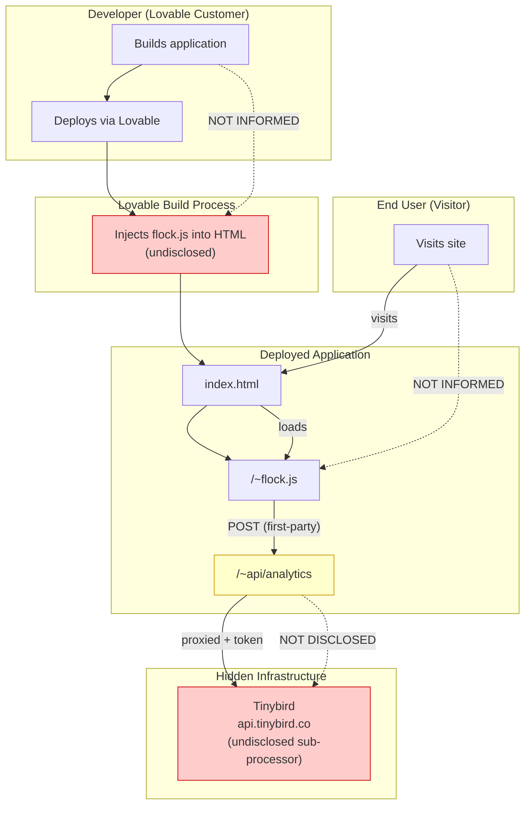
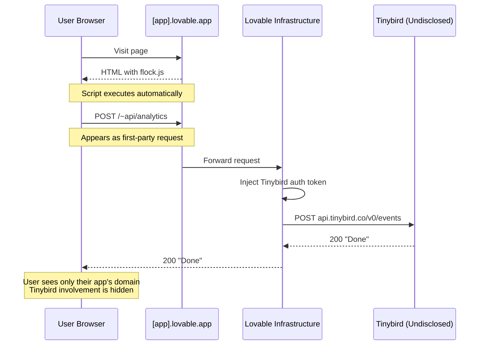

# Lovable Undisclosed Analytics

<div align="center">

**Security Research Report**

| | |
|---|---|
| **Target** | Lovable.dev (`*.lovable.app`) |
| **Date** | November 26, 2025 |
| **Severity** | High |
| **Status** | Verified |

</div>

---

## Table of Contents

1. [Executive Summary](#executive-summary)
2. [Findings Overview](#findings-overview)
3. [Architecture & Data Flow](#architecture--data-flow)
4. [Detailed Findings](#detailed-findings)
5. [Reproduction Steps](#reproduction-steps)
6. [Project Structure](#project-structure)
7. [Technical Reference](#technical-reference)
8. [Recommendations](#recommendations)

---

## Executive Summary

A tracking script (`flock.js`) is injected into **all** deployed Lovable applications during the build process. This injection occurs without disclosure to:

- Developers building on the platform
- End users visiting deployed applications
- Either party's ability to opt out

The script collects user data and transmits it to **Tinybird** (a third-party analytics provider) via a first-party proxy that obscures the true data destination. Tinybird is not listed in Lovable's published Sub-processors List.

Additionally, the analytics proxy endpoint (`/~api/analytics`) accepts **unauthenticated requests**, allowing anyone to inject arbitrary data into Lovable's analytics pipeline.

---

## Findings Overview

| # | Finding | Severity | Description |
|:-:|---------|:--------:|-------------|
| 1 | Unauthenticated Analytics Proxy | **HIGH** | `/~api/analytics` accepts POST from any origin without auth |
| 2 | Undisclosed Sub-processor | Medium | Tinybird receives data but isn't in Sub-processors List |
| 3 | Undisclosed Cookie | Medium | `session-id` cookie not listed in Cookie Policy |
| 4 | Undisclosed Script Injection | Medium | `flock.js` injected without disclosure |

---

## Architecture & Data Flow

### End-to-End Flow



### Proxy Sequence



---

## Detailed Findings

### Finding 1: Unauthenticated Analytics Proxy

| | |
|---|---|
| **Severity** | HIGH |
| **Endpoint** | `https://[app].lovable.app/~api/analytics` |
| **Issue** | Accepts unauthenticated POST requests from any origin |

**Impact:**
- External parties can inject fake analytics data
- No rate limiting observed
- Could corrupt business intelligence
- Could increase Tinybird costs (volume-based billing)

**Proof of Concept:**
```bash
curl -X POST "https://estates-pro.lovable.app/~api/analytics" \
  -H "Content-Type: application/json" \
  -d '{"action":"injected_event","session_id":"attacker","payload":"{}"}'

# Response: HTTP 200 "Done"
```

**Details:** See [`findings/unauthenticated-proxy.md`](findings/unauthenticated-proxy.md)

---

### Finding 2: Undisclosed Sub-processor (Tinybird)

| | |
|---|---|
| **Severity** | Medium |
| **Issue** | Data sent to Tinybird, not listed in Sub-processors |

**Policy vs. Reality:**

| Sub-processors Listed | Not Listed |
|----------------------|------------|
| AWS, GCP, OpenAI, Anthropic, Supabase, ClickHouse, PostHog, Sentry, etc. | **Tinybird** |

**Evidence from flock.js:**
```javascript
t = `https://api.tinybird.co/v0/events?name=${i}&token=${c}`
let i = "analytics_events";  // Tinybird datasource
```

**Details:** See [`findings/proxy-analysis.md`](findings/proxy-analysis.md)

---

### Finding 3: Undisclosed Cookie

| | |
|---|---|
| **Severity** | Medium |
| **Cookie** | `session-id` |
| **Issue** | Not listed in Cookie Policy |

**Cookie Attributes:**
- Name: `session-id`
- Value: UUID v4
- Expiry: 30 minutes (`Max-Age=1800`)
- Scope: Site-wide (`path=/`)

**Policy vs. Reality:**

| Cookies Listed in Policy | Not Listed |
|-------------------------|------------|
| `_tt_enable_cookie`, `__mh_tt_s`, `_ttp`, `ttcsid`, etc. | **`session-id`** |

**Details:** See [`findings/findings-summary.md`](findings/findings-summary.md)

---

### Finding 4: Undisclosed Script Injection

| | |
|---|---|
| **Severity** | Medium |
| **Script** | `/~flock.js` (21,296 bytes) |
| **Issue** | Injected without disclosure |

**Not mentioned in:**
- Privacy Policy
- Cookie Policy
- Terms of Service
- Developer documentation

**Evidence (view source of any `*.lovable.app`):**
```html
<script defer src="https://[app].lovable.app/~flock.js"
        data-proxy-url="https://[app].lovable.app/~api/analytics"></script>
```

**Details:** See [`evidence/flock-js-analysis.md`](evidence/flock-js-analysis.md)

---

## Reproduction Steps

### Quick Verification (Browser Console)

Visit any `*.lovable.app` site and run:

```javascript
// 1. Check for flock.js
document.querySelector('script[src*="flock"]')?.src

// 2. Check for session-id cookie
document.cookie.includes('session-id')

// 3. Test unauthenticated proxy
fetch('/~api/analytics', {
  method: 'POST',
  headers: {'Content-Type': 'application/json'},
  body: '{"action":"test","session_id":"test","payload":"{}"}'
}).then(r => console.log('Vulnerable:', r.status === 200))
```

### Automated Verification

Use the included verification script:

1. Visit any `*.lovable.app` site
2. Open DevTools (F12) → Console
3. Paste contents of [`evidence/verify-findings.js`](evidence/verify-findings.js)
4. Press Enter
5. Review console output + auto-downloaded JSON report

### Manual Network Capture

1. Open DevTools → Network tab
2. Visit a `*.lovable.app` site
3. Navigate between pages
4. Observe POST requests to `/~api/analytics`
5. Export HAR file for evidence

---

## Project Structure

```
final-report/
│
├── README.md                      # This report
│
├── evidence/
│   ├── flock.js                   # Raw tracking script (21,296 bytes)
│   ├── flock-js-analysis.md       # Technical code breakdown
│   └── verify-findings.js         # Browser verification tool
│
├── findings/
│   ├── findings-summary.md        # Policy vs. reality comparison
│   ├── proxy-analysis.md          # How proxy obscures Tinybird
│   └── unauthenticated-proxy.md   # HIGH severity auth bypass
│
├── diagrams/
│   ├── full-flow.mmd              # End-to-end architecture
│   └── proxy-flow.mmd             # Proxy sequence diagram
│
└── reference/
    ├── cookie.md                  # Lovable Cookie Policy
    ├── privacy-policy.md          # Lovable Privacy Policy
    ├── sub-processors.md          # Lovable Sub-processors List
    ├── dpa.md                     # Lovable DPA
    └── tos.md                     # Lovable Terms of Service
```

---

## Technical Reference

### Script Identification

| Property | Value |
|----------|-------|
| Filename | `/~flock.js` |
| Size | 21,296 bytes |
| SHA256 | `a86e084b4f82709814be6c15fd6305daa783fda87ad95402da9a4d3a1dd6d748` |
| Last Verified | November 26, 2025 |

### Data Collected Per Page View

```json
{
  "timestamp": "2025-11-26T12:34:56.789Z",
  "action": "page_hit",
  "version": "1",
  "session_id": "uuid-v4",
  "payload": {
    "user-agent": "Mozilla/5.0...",
    "locale": "en-US",
    "location": "US",
    "referrer": "https://...",
    "pathname": "/page",
    "href": "https://full-url..."
  }
}
```

### Route Pattern

The tilde (`~`) prefix denotes Lovable infrastructure routes:

| Route | Purpose |
|-------|---------|
| `/~flock.js` | Tracking script |
| `/~api/analytics` | Analytics proxy |

This non-standard pattern may avoid detection by common blocklists.

---

## Recommendations

| # | Recommendation | Addresses |
|:-:|----------------|-----------|
| 1 | Add authentication to `/~api/analytics` | Finding 1 |
| 2 | Add Tinybird to Sub-processors List | Finding 2 |
| 3 | Add `session-id` to Cookie Policy | Finding 3 |
| 4 | Disclose flock.js in documentation | Finding 4 |
| 5 | Provide opt-out mechanism for developers | All |

---

## Timeline

| Date | Event |
|------|-------|
| August 2025 | Initial discovery |
| September 2025 | Evidence collection |
| November 26, 2025 | Re-verification, script unchanged |
| November 26, 2025 | Report finalized |

---

